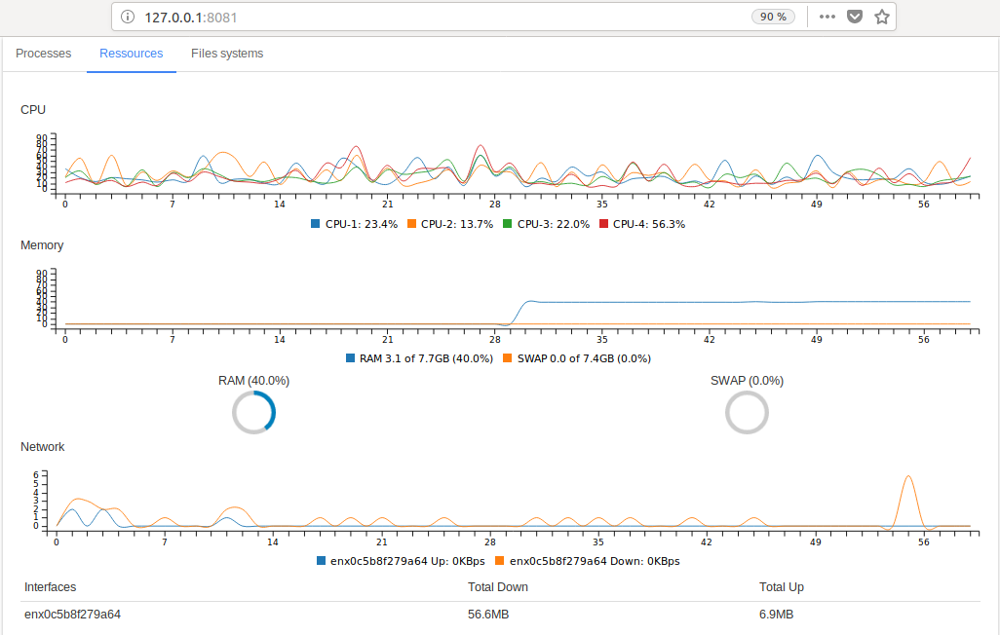
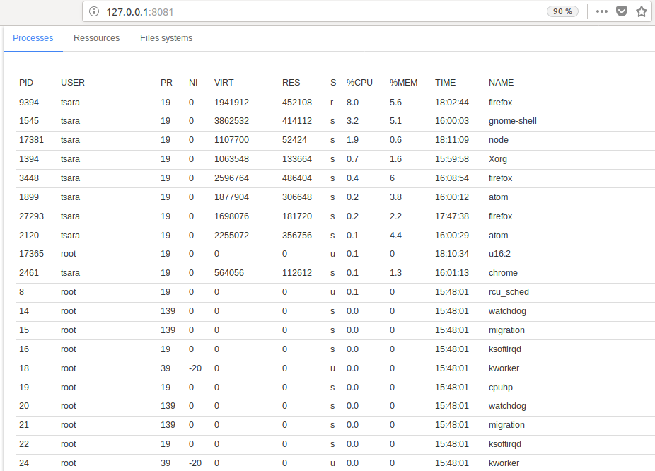
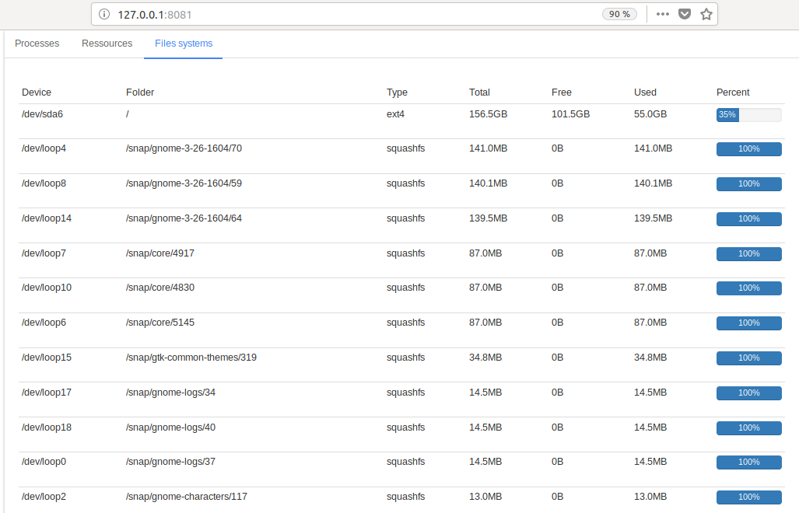

manaraka WUI
=========

A System Monitor like into web page.
Please check [Manaraka](https://github.com/arasT/Manaraka) if you want to use command line instead of web interface.

Screeshoots
---




How to install
---

This app is based on [Node.js](http://nodejs.org/).
It uses:
* [socket.io](https://github.com/socketio/socket.io) for communication between server and client web page.
* [systeminformation](https://github.com/sebhildebrandt/systeminformation) to get informations about: CPU, RAM, SWAP, Networks, Processes, Mounted files system.

And for client side, it uses:
* [jquery](https://github.com/jquery/jquery).
* [bootstrap](https://github.com/twbs/bootstrap).
* [c3js](https://github.com/c3js/c3) to draw chart.
* [easy-pie-chart](https://github.com/rendro/easy-pie-chart) to draw donut chart.

Clone or Download this repository.
```
git clone https://github.com/arasT/ManarakaWUI
```
Extract the archive file and move into it.
```
cd manarakaWUI
```
Install all node modules.
```
npm install
```

Run the app
---

Just launch one of the commands bellow.

```
npm start
```
Or
```
node .
```

Open your favourite browser and go to: http://<server IP>:8081/ (ex: http://localhost:8081/ or http://127.0.0.1:8081/). To change the default port (8081), change the PORT variable into 'app.js' file.

License
----

The MIT License.
Further details see LICENSE file.

Contributing
----

Please fork if you want to contribut to this project.
